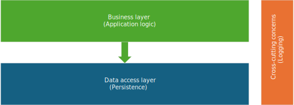

# Main Architecture (Layered Application)

A layered application architecture is a design approach that organizes the components of a software system into distinct layers, each with specific responsibilities.  
This separation of concerns enhances maintainability, scalability, and testability. The main layers typically include:

*Figure 1: A layered architecture with Business Logic, and Data Access layers.*

## 1. Business Logic Layer
The Business Logic Layer (BLL) contains the core functionality and business rules of the application.  
It processes data received from the Data Access Layer and applies business rules.  
This layer ensures that the business rules are consistently applied across the application. 

## 2. Data Access Layer
The Data Access Layer (DAL) is responsible for interacting with the data storage system.  
It provides an abstraction over the data sources, allowing the Business Logic Layer to access data without needing to know the details of the data storage.  

## 3. Cross-cutting Concerns
Crosscutting concerns are aspects of the application that affect multiple layers and components (like logging).  
By centralizing these concerns, the application can maintain consistency and reduce redundancy.  

