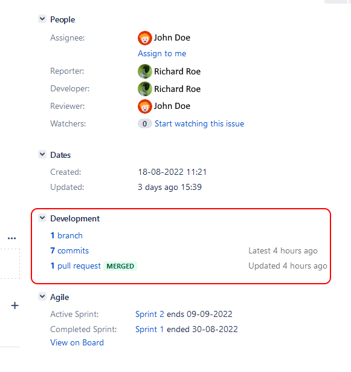
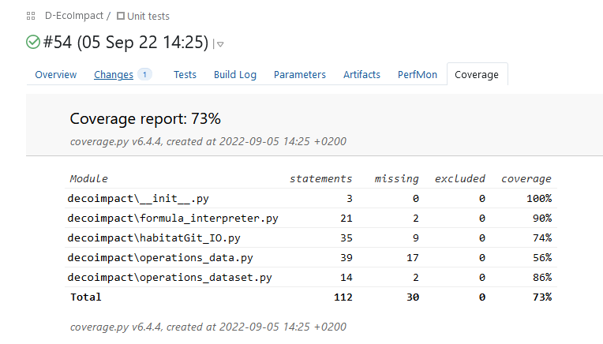

# Development D-Eco Impact
## Workflow
### Developer:
1. Move the jira issue you want to work on from "todo" into "in progress".
(issue should be in the sprint, if not please discuss with product owner about changing the sprint scope).

1. Create a development branch from the main branch with the name based on that of the issue   _feat[issue id] {summary of the issue}_. For example: 
    > **_feat[DEI-123] Improve functionality A_**

    Then switch your local copy to the development branch.

3. Commit the necessary changes with clear messages on what has been done.

1. Verify if all checks have passed (a green checkmark is shown, not a red cross).

    
    Is one or more checks fail, they must be fixed before continuing.

5. Once all checks pass, control if there are any changes in the main branch. If so, merge them to the development branch and fix all possible conflicts in the code, if any, and then go back to point 4 of this list.
 
1. Move the issue from _In progress_ to _In review_ and create a pull-request with the name of the branch previously assigned:
    > _feat[issue id]{summary of the issue}_.

### Reviewer:
1. Change the status of the issue from _In review_ to _Being reviewed_. This should make you automatically the assignee.
1. Look at the development details of the issue.

1. Open the linked pull-request in GitHub.
1. Change the reviewer to yourself if it didn't happen before, as indicated in point 1.

    

5. Go to the _Files changed_ tab to see the modifications implemented for the issue.

    

6. Add your review comments (see [comment on a PR documentation](https://docs.github.com/en/pull-requests/collaborating-with-pull-requests/reviewing-changes-in-pull-requests/commenting-on-a-pull-request) ).

    Some points to analyse during the review are:
    * does the code work, including corner cases?
    * is the code in the right place?
    * is it readable?
    * is the code documented (all public methods and classes should have doc strings)?
    * are nameing conventions used properly?
    * is there any duplication of the code?
    * Is the code maintainable?
    * is the code covered by tests?
    * are all tests and checks green?
    * are the commit messages clear enough and do the satisfy the conventions?
    
    
7. Set the status of the issue (comment, approve or request changes).
    
1. Change the status if the issue in Jira corrspondingly:

    * Approved -> _In Test_
    * Request changes -> _To do_
    * Comment -> _In review_ (with the developer as assignee).

### Tester:
1. Change issue status from "in test" to "being tested". This should make you the assignee.
 
1. For a bug or improvement, check out the main branch and try to reproduce the issue or to get familiar with the previous functionality.
 
1. Change your local check-out to the development branch (from which the pull-request was created).
 
1. Test now the new functionality or bug fix by running the main script from python in a clean python environment.

1. Try to think of situations or conditions that may have been forgotten to implement properly, and test these as well.
 
1. Add comments in the issue with your findings (ok or not because ...). Describe enough in detail so that other people can easily reproduce any problems found. If needed, provide any required (additioonal) data.
 
1. Move the issue in Jira to the new corresponding state:
    * If the test is ok, to _Merge_.
    * If the test is not ok, move to _To do_.

### If test is succesful

1. Go to pull request on GitHub.

1. Check if there will be merge conflicts (shown by GitHub) and if the development branch is up to date with the main branch.

    * If any merge conflicts are reported, then check with developer to resolve the merge issues.
    * If the branch does not have any merge conflicts and is not up to date -> press the update branch button.

3. If the branch is up to date and does not have merge conflicts you can merge the pull request to the main branch.

1. Change issue status in jira from "merge" to "validate".

1. Change your local checkout to the main branch and do a few checks to see if the merge was correct.

1. If the merge was successful, change issue status in jira from "validate" to "done".

### Agreements
 
#### Coding:

* We use the [PEP8 style guide](https://pep8.org/) for python development.
* We use [typing](https://docs.python.org/3/library/typing.html) where possible.
* We avoid using global variables.
* We use encapsulation by only making the necessary imports and variables public.
 
* For testing, we use the _pytest_ module.
* For checking the style guide, we use _flake8_ and _pylint_.
* For managing external dependencies, we use poetry (.toml file).
 
* We prefer to use VS Code for development (sharing settings using vscode folder) with the following plugins:
    * [autoDocstring](https://marketplace.visualstudio.com/items?itemName=njpwerner.autodocstring)
    * [python](https://marketplace.visualstudio.com/items?itemName=ms-python.python)