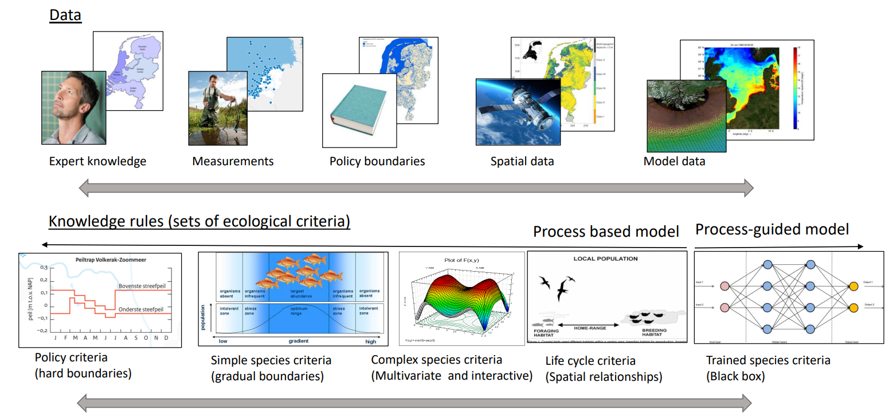

# Introduction

## Vision
D-Eco Impact is an open source spatial ecological impact postprocessing model. This model is focused on aquatic application, suitable for coastal, river, lake, rural and urban applications. The model applies criteria rules to environmental conditions to evaluate the ecological state. These environmental conditions can be of varying detail (e.g. expert knowledge, measurements, or model output). The criteria applied can be of varying complexity (e.g., hard boundaries, gradual boundaries, multi variant relationships and AI deduced models). D-Eco Impact makes sure that the technical burden of applying these criteria to these environmental conditions is reduced.
By reducing this technical burden, the following benefits can be achieved:

- It will be easier to make use of differing environmental data sources and change them when new environmental model output or better describing data sources become available, without changing the ecological criteria.
- More time can be spent on exploring the ecological criteria used and improving on knowledge that supports them.
- The effect of changing the ecological criteria or underlying environmental data on the ecological result can be easier explored (e.g. spatial/ temporal resolution, accuracy of the environmental data used, missing pressures, knowledge rules used) while comparing the modelled result with the current situation in the field.

We distinguish between four types of users for D-Eco Impact:

- Users assessing the model results.
- Users working with the model using established functionality through the input file.
- Users expanding on the model by developing prototype functions on the existing framework.
- Developers or co-creators of the model adding accepted functionality that will be available to other users of the model.

 result for ecological impact assessment. D-Eco Impact operates with one single environmental input data file format and one single input file that contains the ecological criteria that will be assessed. ")

To support D-Eco Impact in providing one environmental input dataset and the analyses of the results we make use of the HydroMT_habitat plugin. HydroMT_habitat combines and prepares environmental data from various sources (e.g., expert knowledge, measurements, or model output) to one coherent dataset of environmental conditions, ready to be analyzed by D-Eco Impact. This dataset is a NetCDF file following the [UGRID data format](https://ugrid-conventions.github.io/ugrid-conventions/). developed for storing 1D, 2D and 3D (unstructured) data. HydroMT_habitat is also meant as a post-processing module, translating the D-Eco Impact result to a user required data format (e.g., shapefile, geopackage, GeoTiff, CSV) and providing statistical summaries (e.g. area created, change with previous scenario, most limiting environmental variable, least limiting environmental variable). 

 result for ecological impact assessment. HydroMT_habitat takes care of the conversion between data source formats to one combined file in the UGRID NetCDF format. This file is provided to D-Eco Impact and based on the data encountered in the file this model will use the right approach to apply the provided criteria to the provided data. The result of D-Eco Impact, also in the UGRID NetCDF format, is translated to the user required format by using the module HydroMT_habitat. This module is also able to derive a statistical summary from the provided D-Eco Impact result (e.g.,area created, change with previous scenario, most limiting environmental variable, least limiting environmental variable).")
