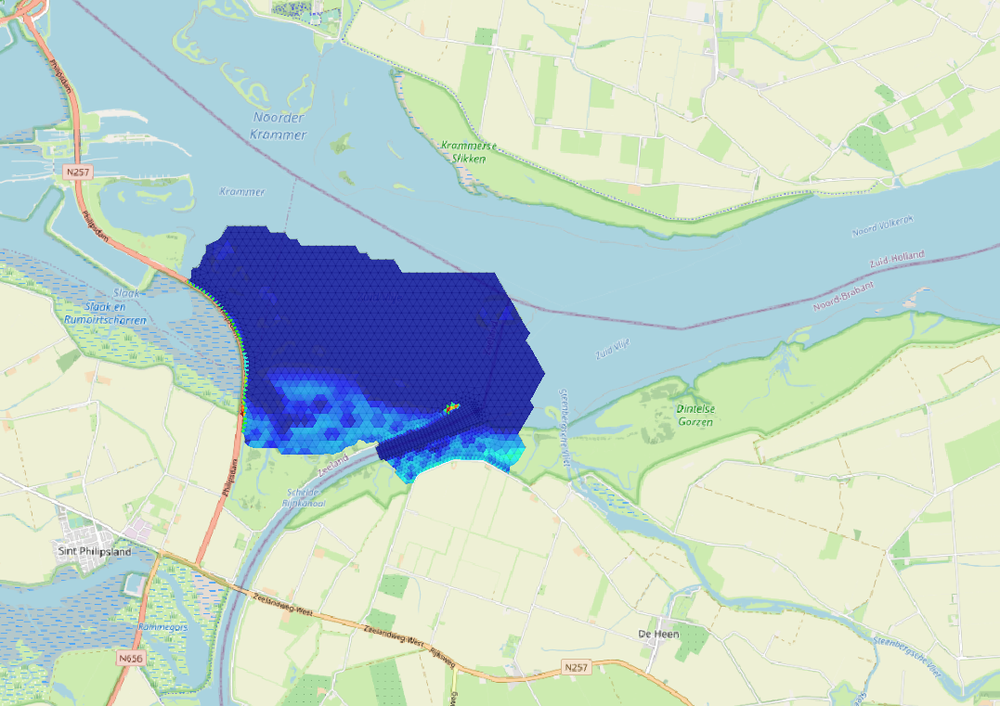

# Structure of the model input file and functionality

D-Eco Impact is steered through a YAML input file. This input file informs the model which data to use, what ecological knowledge rules to apply and where to write the output data. 
The easiest way to edit these YAML files is by using [Notepad++](https://notepad-plus-plus.org/downloads/). When starting with your first application with D-Eco Impact, make use of earlier models to setup your YAML input file and edit from there. When running the YAML file with D-Eco Impact, the model will inform you if there are inconsistencies in the file provided. 

## Importing and exporting data
Importing and exporting data is always arranged in the input-data and output-data header in the YAML file.  

```
version: …………………….

input-data:
	…………………….
rules:
	…………………….
output-data:
	…………………….
```

The variables present in the input data, provided through “filename”, are selected for use. The filename is able to accept a pattern including a * in the name. Instead of using one single input file, all files matching the pattern within the folder are being processed by the same input_file.yaml. So, for example, if in a folder there are two files test_1.nc and test_2.nc, the user can set the filename to "test_\*.nc" and both files will be processed. It is possible to filter the input data by providing a start date or end date (format: "dd-mm-yyyy"); this is optional. The variables that are used can be selected under “variable_mapping”. Here, you are also able to rename variables as the name used for storage is often cryptic. 

At output data the location where the output file needs to be written can be provided through “filename”. In this output file only variables that have been used from the input data and variables that have been created in the model are stored. If the user gives a pattern (filename with asterisk for partitions) in the input-data filename, the output-data filename needs to match the corresponding amount of files that are being processed. Again in the example of two files (test_1.nc and test_2.nc) and an input-data filename of "test_\*.nc", the user can either give an output-data filename with or without an asterisk. Without an asterisk (eg "output.nc"), the partitioned part of the input filename is used and extended to the output-data filename ("output_1.nc" and "output_2.nc"). With an asterisk (eg "\*_output.nc") the \* will provide the place where the partitioned part of the input file will be placed ("1_output.nc" and "2_output.nc"). It is possible to reduce the file size with the optional parameter "save_only_variables", which can take the name of one or several variables.
The model needs at least one rule under “rules” to execute.

```
#FORMAT
version: <D-Eco_Impact_version_nr>

input-data:
  - dataset:
      filename: <path_to_file_including_file_name_and_type>
      start_date: "<start_date>"
      end_date: "<end_date>"
      variable_mapping:
        <variable1_input_file>: "<variable1_name_in_model>"
        <variable2_input_file>: "<variable2_name_in_model>"
        ………
rules:
        ………
output-data:
  filename: <path_to_file_including_file_name_and_type>
  save_only_variables: <variable, or list_of_variables>
```

```
#EXAMPLE  : Reading and writing an example model of the Volkerak-Zoommeer
version: 0.1.5

# Mapping: mesh2d_sa1              : Salinity (PSU)
#          mesh2d_s1                : Water level (m NAP)
#          mesh2d_waterdepth : Water depth (m NAP)
input-data:
  - dataset:
      filename: examples/data/FM-VZM_0000_map.nc
      start_date: "01-01-2011"
      end_date: "31-12-2015"
      variable_mapping:
        mesh2d_sa1: "salinity"
        mesh2d_s1: "water_level"
        mesh2d_waterdepth: "water_depth"

rules:
  - multiply_rule:
      name: make variable test
      description: Make a variable called test for testing purposes
      multipliers: [1.0]
      input_variable: water_depth
      output_variable: test

output-data:
  filename: examples/data_out/results_test8c.nc
  save_only_variables: test
```

## Functionality
The functionality is always arranged in the form of rules under the rules header in the yaml file.

```
version: …………………….

input-data:
	…………………….
rules:
	…………………….
output-data:
	…………………….

```

The output of the following functionalities has been shown for a section of the Lake Volkerak 3D hydrodynamic model in the Netherlands. This hydrodynamic model output contains 6 years of data (2011 – 2016), with a timestep of 10 days. The 3D hydrodynamic model has been setup with 22 vertical layers and 3290 horizontal flexible mesh grid cells.




## Rules














## Including data from another YAML file

It is possible to include data in the YAML file that originates from another file. At the moment this is only applicable to another YAML file. This can be useful for storing large classification_rule tables in a separate file (for a better overview of the work file), but this functionality is not limited to that specific rule.

Here is the original rule:
```
#EXAMPLE  : Original
# This is a simplified example, only top layer of flow velocity and chloride was used and year statistics

  - classification_rule:
      name: classification for aquatic plants
      description: classification for aquatic plants based on water depth, flow velocity and chloride.
      criteria_table:
        - ["output", "MIN_water_depth_mNAP", "MAX_flow_velocity", "MAX_chloride"]
        - [     1  ,               "<0.10" ,                "-" ,            "-"] # too dry
        - [     2  ,                ">4.0" ,                "-" ,            "-"] # too deep
        - [     3  ,                   "-" ,                "-" ,         ">400"] # too salty
        - [     4  ,                   "-" ,             ">1.5" ,            "-"] # too fast flowing
        - [     5  ,            "0.10:4.0" ,          "0.0:1.5" ,        "0:400"] # perfect for aquatic plants
```

And this is the rule while making using of an inclusion from another file:
```
#EXAMPLE  : Original
# This is a simplified example, only top layer of flow velocity and chloride was used and year statistics

  - classification_rule:
      name: classification for aquatic plants
      description: classification for aquatic plants based on water depth, flow velocity and chloride.
      criteria_table: !include tables/aquatic_plant_criteria.yaml
      input_variables: ["MIN_water_depth_mNAP", "MAX_flow_velocity", "MAX_chloride"]
      output_variable: aquatic_plant_classes
```
And this is the included file from tables/aquatic_plant_criteria.yaml:
```
        - ["output", "MIN_water_depth_mNAP", "MAX_flow_velocity", "MAX_chloride"]
        - [     1  ,               "<0.10" ,                "-" ,            "-"] # too dry
        - [     2  ,                ">4.0" ,                "-" ,            "-"] # too deep
        - [     3  ,                   "-" ,                "-" ,         ">400"] # too salty
        - [     4  ,                   "-" ,             ">1.5" ,            "-"] # too fast flowing
        - [     5  ,            "0.10:4.0" ,          "0.0:1.5" ,        "0:400"] # perfect for aquatic plants
```
