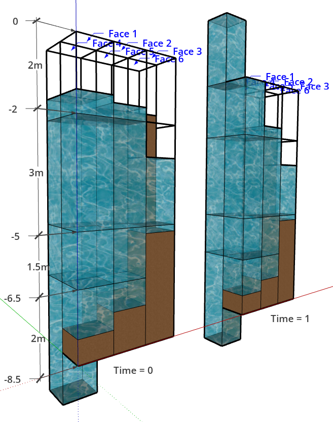

### Depth average rule

```
FORMAT
- depth_average_rule:
      name: <name_of_rule_in_text>
      description: <description_of_rule_in_text>
      input_variable: <one_input_variable_name>
      bed_level_variable: <variable_indicating_bed_level>
      water_level_variable: <variable_indicating_water_level>
      interfaces_variable: <variable_indicating_interfaces>
      output_variable: <one_output_variable_name>
```

The depth average rule allows for an averaging over depth using the weighted values according to a mesh with z- or sigma-layers. The current implementation is only tested for input netCDF files generated by D-Hydro. The input file must include a variable containing the location of the horizontal interfaces between the layers over which the input variable will be averaged. Also two variables specifying the bedlevel and water level are needed. The input_variable will be a 2D/3D variable, with or without time axis. The output_variable has the same dimensions, excluding the dimension for the depth, as it will be represented as one averaged value per cell.

Note: combined z-sigma layers are currently not supported.

An explanation of how the depth rule works is shown in the example below.



The image shows a simplified model with the following dimensions:
- mesh2d_nFaces = 6 (number of faces)
- mesh2d_nLayers = 4 (number of layers in the z direction)
- mesh2d_nInterfaces = 5 (number of interfaces that define the depth)
- time = 2

Below are the variables belonging to this example:

$$
mesh2d\_interface\_z_{(mesh2d\_nInterfaces)} =
\begin{bmatrix}
\ 0 \\
\ -2 \\
\ -5 \\
\ -6.5 \\
\ -8.5 \\
\end{bmatrix}
$$

$$
salinity _{(time, nFaces, nLayers)}=
\begin{bmatrix}
      \begin{bmatrix}
            1 & 1 & 1 & 1 & 1 & 1 \\
            2 & 2 & 2 & 2 & 2 & 2 \\
            3 & 3 & 3 & 3 & 3 & 3 \\
            4 & 4 & 4 & 4 & 4 & 4
      \end{bmatrix}
      \begin{bmatrix}
            1 & 1 & NaN & 1 & 1 & 1 \\
            2 & 2 & 2 & 2 & 2 & 2 \\
            3 & 3 & 3 & 3 & 3 & 3 \\
            4 & 4 & 4 & 4 & 4 & 4
      \end{bmatrix}
\end{bmatrix}
$$

$$
mesh2d\_s1 _{(mesh2d\_nFaces, time)} =
\begin{bmatrix}
      -1.4 & 0 \\
      -1.6 & -1.6 \\
      -3 & -3 \\
      -1.4 & 3 \\
      -1.6 & -1.6 \\
      -1.6 & -1.6
\end{bmatrix}
$$

$$
mesh2d\_flowelem\_bl _{(mesh2d\_nFaces)}=
\begin{bmatrix}
      -7.8 \\ -7.3 \\ -5.2 \\-9.5 \\ -7 \\ -1.6 \\
\end{bmatrix}
$$

This example results in the following output_variable.

$$
input\_variable _{(nFaces, time)}=
\begin{bmatrix}
      2.546875 & 2.269231 \\
      2.473684 & 2.473684 \\
      2.090909 & 2.090909 \\
      2.851852 & 2.2 \\
      2.388889 & 2.388889 \\
      NaN & NaN \\
\end{bmatrix}
$$


Below is an example of an input_file for the depth average rule:

```
#EXAMPLE  : Determine a depth average for over salinity
  - depth_average_rule:
      name: test depth average
      description: Test depth average
      input_variable: salinity
      bed_level_variable: mesh2d_flowelem_bl
      water_level_variable: mesh2d_s1
      interfaces_variable: mesh2d_interfaces_sigma
      output_variable: average_salinity
```