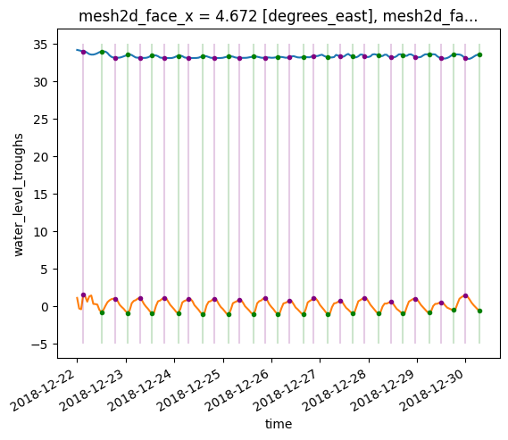

### Filter extremes rule

```
FORMAT
- filter_extremes_rule:
      name: <name_of_rule_in_text>
      description: <description_of_rule_in_text>
      input_variable: <one_input_variable_name>
      output_variable: <one_output_variable_name>
      extreme_type: troughs or peaks
      distance: <int_of_time_scale>
      time_scale: second, hour, day, month or year
      mask: <boolean>
```


The filter extremes rule allows for temporal filtering of extremes in a dataset, i.e. peaks (local maxima) and troughs (local minima). The input variable can be any dimension, as long as it has a time dimension. If the variable mask = False, the output is a variable with the same shape as the input, but only values where the peaks occur and NaN values where no peak occur. If mask = True the output is a same sized variable with 1 (True) at the peak values and NaN elsewhere. Furthermore the user can add a distance (with timescale) as input to define the minimum distance between two peaks/troughs. This mask can be applied to another layer with the combine rule (operation: multiply).

Below an example of an input file to use the filter_extremes_rule.

```
#EXAMPLE  : Determine the peak waterlevel values
  - depth_average_rule:
      name: test filter extremes
      description: test filter extremes
      input_variable: water_level
      output_variable: water_level_mask
      extreme_type: peaks
      distance: 12
      time_scale: hour
      mask: True
```
The input above is part of a simple test to calculate the salinity at the peaks and troughs of the waterlevel. The extreme filter rule is first used to get the locations of the peaks and throughs of the water level (mask = True) and then with the combine rule the values of the salinity at these points are calculated. The figure below shows these results, the salinity (blue line) and water level are plotted (orange line). The calculated peaks and troughs are shown in purple and green respectively. This example can be reproduced with an iPython notebook (in D-EcoImpact/scripts/test_extreme_filter.ipynb), in this file is also the input_file.yaml included that is used for the calculation.


